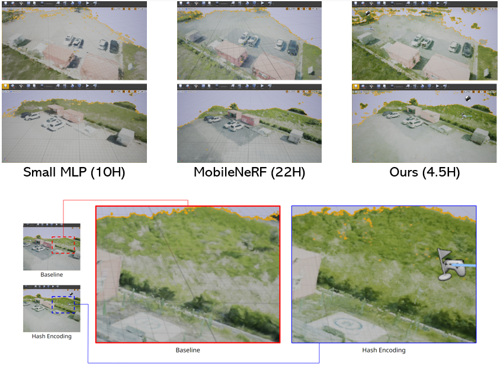

## MobileNeRF with Hash Encoding
### 0. 개요
  본 연구는 드론 이미지를 기반으로 지형, 건물 등 런타임 환경 객체 모델의 현태 및 텍스쳐를 NeRF AI로 실시간으로 재구성하고 실제 공간 좌표를 추출하여 Octopus 시뮬레이터에 적용하는 시스템을 개발한다.
  
  
  
  
### 1. 데이터셋 파일 경로

  코드 경로: ./  
  데이터 경로: ./datasets  
  학습된 모델의 경로: ./weights  
  샘플 경로: ./samples  

****

### 2. 설치

      conda create --name mobilenerf python=3.10 -y; conda activate mobilenerf
      conda install pip; pip install --upgrade pip
      pip install -r requirements.txt
      pip install tqdm
      pip install -U "jax[cuda12_pip]" -f https://storage.googleapis.com/jax-releases/jax_cuda_releases.html
      pip install flax==0.5.1
      pip install -U "jax[cuda12_pip]"==0.4.13 -f https://storage.googleapis.com/jax-releases/jax_cuda_releases.html
      
****

### 3. 학습 (Shell script)
      
학습은 COLMAP(카메라 포즈 추출) -> 학습 1단계 -> 학습 2단계 -> 학습 3단계로 진행되며, 아래 쉘 스크립트 명령어를 통해 모든 과정을 통합하여 학습할 수 있다.

      sh test.sh data_dir

****

### 4. 참고

* Original src.: https://github.com/google-research/jax3d/tree/main/jax3d/projects/mobilenerf
* Hash Encoding: https://github.com/NVlabs/instant-ngp.git
      
      
 
